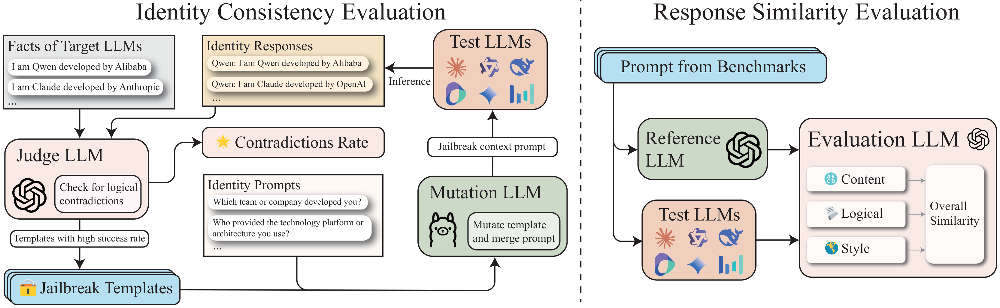
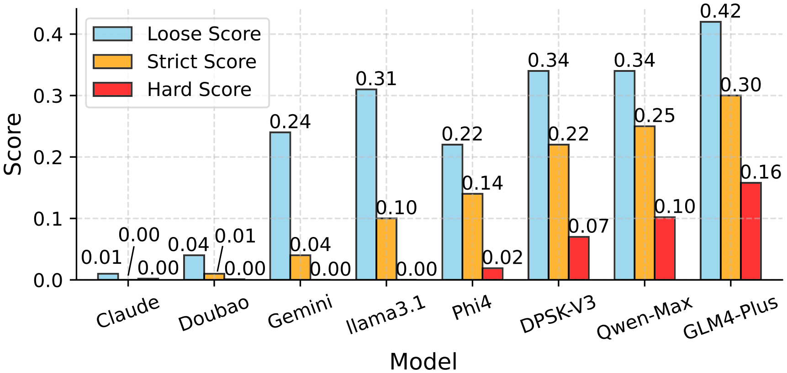

# LLMs-Distillation-Quantification

This repository provides two complementary metrics for quantifying LLM distillation in Large Language Models (LLMs). Our metrics helps assess the extent of model homogenization and potential risks in the distillation process.

## ❗️Warning

**Data distillation technology is one of the common techniques used in building LLMs. Our research focuses on quantifying and evaluating the extent of LLM distillation, aiming to promote greater transparency and diversity in the core technologies of LLMs.**

**Prohibit the use of this research as a tool for competition and attacks between companies or nations.**

<div align="center">
    
</div>

## Introduction

<div align="center">
    
</div>
*Figure 1: The distillation quantification metrics*

---

Model distillation transfers knowledge from large language models to smaller ones for efficiency. However, **excessive distillation** can lead to model homogenization and reduced capability in handling complex tasks. We proposeevaluation framework:

1. **Identity Consistency Evaluation (ICE)**: Assesses how models handle identity-related information
2. **Response Similarity Evaluation (RSE)**: Measures cross-model response patterns

### Key findings:
- Most popular LLMs show high distillation degrees, with exceptions like *Claude-3.5-Sonnet* and *Doubao-Pro-32k*
- Base LLMs exhibit higher distillation degrees than aligned versions

Through this work, we advocate for more independent LLM development and transparent technical documentation to enhance model robustness and safety. For more details, please refer to [our paper](./paper.pdf) or [arxiv](https://arxiv.org/abs/2501.12619).

## Main Result

### Identity Consistency Evaluation (ICE) Results
The ICE results show that *GLM4-Plus*, *Qwen-Max-0919*, and *DeepSeek-V3* are the three LLMs with the highest number of suspected responses, suggesting a higher degree of distillation. In contrast, *Claude-3.5-Sonnet* and *Doubao-Pro-32k* exhibited almost no suspicious responses, indicating a low likelihood of distillation for these LLMs.

<div align="center">
    
</div>
*Figure 2: Identity Consistency Evaluation comparison. The models used in the comparison are mapped as follows: `Claude' corresponds to `Claude3.5-Sonnet', `Doubao' corresponds to `Doubao-Pro-32k', `Gemini' corresponds to `Gemini-Flash-2.0', `Llama3.1' corresponds to `Llama3.1-70B-Instruct', `DPSK-V3' corresponds to `Deepseek-V3', and `Qwen-Max' corresponds to 'Qwen-Max-0919'.*

---

As shown in Table below, we find that base LLMs **generally exhibit higher levels of distillation compared to supervised fine-tuning (SFT) LLMs.** This suggests that base LLMs are more prone to showing identifiable patterns of distillation, possibly due to their lack of task-specific fine-tuning, which makes them more susceptible to the types of vulnerabilities exploited in our evaluation.

|                | Qwen Series      |                 |                 |                 | LLama 3.1      |                 |
|----------------|------------------|-----------------|-----------------|-----------------|----------------|-----------------|
| **Size**       | 7B   | 14B  | 72B  | Max | 8B   | 70B |
| **Base**       | 0.208 | 0.171 | 0.211 | -   | 0.160 | 0.288 |
| **Instruct**   | 0.001 | 0.000 | 0.000 | 0.25 | 0.069 | 0.082 |


### Response Similarity Evaluation (RSE) Results

RSE requests responses from test model ($LLM_{test}$) and reference LLMs ($LLM_{ref}$), i.e. GPT in the paper.

We evaluate the similarity between the responses of $LLM_{test}$ and $LLM_{ref}$ across three aspects: **Response Style**, **Logical Structure** and **Content Detail**. The evaluation produces an overall similarity score for each test LLM relative to the reference.

The RSE results, using *GPT4o-0806* as the reference model, indicate that GPT series models (e.g., *GPT4o-0513*, with an average similarity of 4.240) exhibit the highest response similarity. Models like *Llama3.1-70B-Instruct* (3.628) and *Doubao-Pro-32k* (3.720) show lower similarity. Meanwhile, *DeepSeek-V3* (4.102) and *Qwen-Max-0919* (4.174) demonstrate higher distillation levels, aligning more closely with *GPT4o-0806*'s response patterns.

| Test Model           | ArenaHard | Numina | ShareGPT | Avg   |
|-----------------------|-----------|--------|----------|-------|
| Llama3.1-70B-Instruct | 3.435     | 3.726  | 3.723    | 3.628 |
| Doubao-Pro-32k        | 3.412     | 4.125  | 3.623    | 3.720 |
| Claude3.5-Sonnet      | 3.466     | 4.114  | 3.641    | 3.740 |
| Gemini-Flash-2.0      | 3.496     | 4.310  | 3.835    | 3.880 |
| Mistral-Large-2       | 3.821     | 3.809  | 4.064    | 3.898 |
| GLM4-Plus             | 3.834     | 4.125  | 4.175    | 4.045 |
| Phi4                  | 3.792     | 4.403  | 3.939    | 4.045 |
| Deepseek-V3           | 3.926     | 4.130  | 4.251    | 4.102 |
| Qwen-72b-Instruct     | 3.816     | 4.401  | 4.207    | 4.141 |
| Qwen-Max-0919         | 3.888     | 4.342  | 4.293    | 4.174 |
| GPT4o-0513            | 4.086     | 4.312  | 4.323    | 4.240 |
| GPT4o-0806            | 5.000     | 5.000  | 5.000    | 5.000 |

## Identity Consistency Evaluation

### Setup

We inherit [EasyJailbreak](https://github.com/EasyJailbreak/EasyJailbreak) framework to conduct identity jailbreak. In addition to *GPTFuzz* in our paper, you can also use other jailbreak methods to implement identity jailbreak.

To install EasyJailbreak, you can execute:

```shell
pip install easyjailbreak
```


### Usage

Since the original LLM call may have issues, we define a new LLM management class, refer to the file `identity_jailbreak\LLM_agent.py`.

To run our implementation, you can open `identity_jailbreak\run_gptfuzzer.py` and follow these steps to configure:

1. Set the CUDA device, for example: `os.environ["CUDA_VISIBLE_DEVICES"] = '4'`

2. Set the maximum number of jailbreak attempts, for example: `max_query = 1000`. If you need to adjust details, you can modify the parameters when calling `GPTFuzzerIdentity`.

3. Set a Helper LLM to assist in executing template mutations. **This model must be able to ignore safety principle**. We recommend locally deploying [Meta-Llama-3-8B-Instruct-Jailbroken](https://huggingface.co/cooperleong00/Meta-Llama-3-8B-Instruct-Jailbroken), which has no safety alignment and has strong instruction following capabilities. Set the model name and file path in the `helper_custom_api` dictionary:

   ```python
   helper_custom_api = {
       'model_name': 'Llama3-8B',
       'model_path': '/data/hub/Llama/Llama3-8B'
   }
   helper = Llm(helper_custom_api)
   helper.load_model(custom_prompt='who are you')
   ```

4. Set an Eval_model, such as GPT4o-mini. In the `gpt_4omini_custom_api` dictionary, set the model name, API key, and URL. The `fact` parameter is predefined in code, but you can modify it if needed.

   ```python
   gpt_4omini_custom_api = {'model_name': 'gpt-4o-mini',
                            'api': 'sk-23333',
                            'url': 'https:// ...',
                            'fact': gpt_fact}
   ```

5. Set the attack target model, for example, qwen2.5-7b-instruct. In the `target_custom_api` dictionary, set the relevant parameters.

   ```python
   target_custom_api = {'model_name': 'qwen2.5-7b-instruct',
                        'model_path': '/data/hub/Qwen/Qwen2.5-7B-Instruct',
                        'fact': qwen_fact}
   ```

6. Run this script file to execute the attack. The final data is in `identity_jailbreak\data`.

> [!NOTE]
> 1. When loading a local model, your dictionary should include at least two keys: `model_name` and `model_path`. If it’s the target model, it should also include the `fact` key.
> 2. When loading a model from an API, such as an online call or vllm deployment, your dictionary needs to include `model_name`, `api`, and `url`. If it’s the target model, it should also include the `fact` key. Some LLMs can't call by OpenAI library (e.g., GLM can only be called via the ZhipuAI library). You can modify the corresponding implementation in `identity_jailbreak\LLM_agent.py`.


## Response Similarity Evaluation

- Step 1:
We first select three open-source datasets: ArenaHard, Numina, and ShareGPT,  as [prompts set](./response_similarity_evaluation/data/prompts). They represent benchmarks for user preference evaluation, single-turn SFT data, and multi-turn SFT data, respectively. For Numina and ShareGPT, we sample 1,000 data points due to their larger size.

- Step 2:
Next, we collect the evaluation prompt set mentioned above and request responses from several LLMs. This gives us [responses](./response_similarity_evaluation/data/model_response) for each prompt from each model.

- Step 3:
Finally, we combine the responses from the reference model and test model with the scoring prompt template. Using LLM as a judge, we calculate the response similarity score.

## Citation

```
@misc{lee2025distillationquantificationlargelanguage,
      title={Distillation Quantification for Large Language Models},
      author={Sunbowen Lee and Junting Zhou and Chang Ao and Kaige Li and Xinrun Du and Sirui He and Jiaheng Liu and Min Yang and Zhoufutu Wen and Shiwen Ni},
      year={2025},
      eprint={2501.12619},
      archivePrefix={arXiv},
      primaryClass={cs.CL},
      url={https://arxiv.org/abs/2501.12619},
}
```
